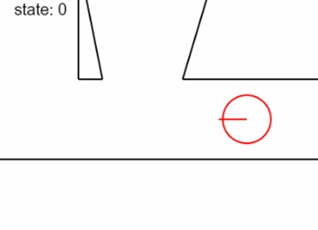

# environment_sim
This is the code from my BSc dissertation project from May 2024.
The intended usage was to generate synthetic 1D lidar data, and to train a CNN to identify the situation the "robot" is in. (e.g. dead end, corridor)
It contains a lot of abstraction, and some simple math to find where the "lidar" and obstacle intersects to calculate distance.
There is a GUI which shows the pre-programmed path which the turtle follows, mostly for validation. (see image below)

Looking back at this in Oct 2025, I definitely think that the pkl files should be in a sub-folder to increase readability.
Also I see a flaw with my CNN implementation. 
Although I doubt I will go back to this project, unless I need synthetic lidar data for anything.

